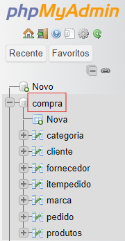

# 📃Descrição
Este código projeta um site de compra com o banco de dados, onde você irá adicionar um produto, marca e a categoria deste item, onde será colocado ao banco de dados.
Criamos um banco de dados com o nome Compra onde tudo que será feito irá ficar nele.  
  
<<<<<<< HEAD
A baixo está o código funcionando, depois de cadastrar em cada uma das funções.

=======

>>>>>>> 67419afa4f50703b3981179106e175575cecff7b

# ⚙️Função
🔸Iniciamo o código com um arquivo de ``conexão`` que está dentro da pasta controller, onde conecta ``PHP`` com ``Banco de dados.``  
$user: Nome de usuário do banco de dados.    
$pass: Senha do usuário do banco de dados.  
$server: Endereço do servidor MySQL.  
$db: Nome do banco de dados que será utilizado, neste caso o Banco ``Compra``  

    $user = 'root';  
    $pass = '';  
    $server = 'localhost';  
    $db = 'compra';  

🔸O código a baixo estabelece uma conexão com o banco de dados MySQL utilizando a função ``mysqli_connect()``. O resultado da função é armazenado na variável ``$mysqli``, que será um objeto representando a conexão com o banco de dados.  

    $mysqli = mysqli_connect($server, $user, $pass, $db);

🔸Este código está definindo o conjunto de caracteres a ser usado para a comunicação com o banco de dados como ``UTF-8``. Isso é importante para garantir que os dados armazenados e recuperados do banco de dados.

    $mysqli->set_charset('utf8');

🔸Iremos verificar se ocorreu algum erro durante a tentativa de conexão com o banco de dados. A propriedade ``connect_error`` da variável ``$mysqli`` armazena qualquer mensagem de erro de conexão.
Caso houver um erro de conexão, a função ``die`` é chamada, exibindo a mensagem ``'Connect Error'``.

    if ($mysqli->connect_error){
        die ('Connect Error');
    }  

<<<<<<< HEAD
🔹

=======
🔹Agora dentro do arquivo ``categoria.php`` utilizamos o código a baixo, ele tem a função de incluir o conteúdo do arquivo conexao.php dentro do script atual. Ao usarmos o include_once, iremos garantir que o código de conexão seja incluído apenas uma vez, evitando a execução repetida e possíveis erros associados a múltiplas inclusões.  
Também dentro do arquivo ``categoria.php`` utilizamos um Input onde o usuário irá colocar a descrição do produto.

    <?php
    include_once('controller/conexao.php');
    ?>

🔹Dentro do arquivo ``insere-categoria.php`` ele está puxando o que foi colocado dentro da ``descrição`` de ``categoria.php`` e armazenando dentro da váriavel.

    $descricao = $_POST['descricao'];

Já aqui, criamos uma string contendo uma consulta SQL para inserir o valor da variável $descricao na tabela categoria na coluna DESCRICAO.  
O valor de $descricao é inserido diretamente na consulta SQL.

    $cad_categoria = "INSERT INTO categoria(DESCRICAO) VALUES ('$descricao')";

No if estamos execultando a consulta SQL armazenada em ``$cad_categoria`` usando a função ``mysqli_query()``, passando a conexão $mysqli e a consulta SQL. o resultado desta consulta é passado para o If.   
Com o Else ele está verificando se caso a consulta falhar ele irá gerar uma mensagem pela função ``mysqli_error($mysqli).``

    if(mysqli_query($mysqli, $cad_categoria)){
    echo "<h1>Categoria cadastrada com sucesso! </h1> ";
    }else{
        echo "Erro: " . $cad_categoria . " " . mysqli_error($mysqli);
    }
Já este código final e para fechar o banco de dados depois de ter completado todas estas funções anteriores.

    mysqli_close($mysqli);

🔹Dentro do arquivo de ``marca`` criamos também um input onde será adicionado o nome da marca desejada
Já dentro do ``insere-marca.php`` ele irá fazer as mesmas funções de ``Insere-categoria.php`` mas com a ``marca.``

    $marca = $_POST['marca'];

    echo "<h3>Marca: $marca </h3> ";

    $cad_marca = "INSERT INTO marca(DESCRICAO) VALUES ('$marca')";

    if(mysqli_query($mysqli, $cad_marca)){
    echo "<h1>Marca cadastrada com sucesso! </h1> ";
    }else{
        echo "Erro: " . $cad_marca . " " . mysqli_error($mysqli);
    }

    mysqli_close($mysqli);

🔹No arquivo ``produtos.php`` criamos 2 forms, um para categoria e outro para marca, onde cada um deles irá criar seus input onde deverá ser inserido o Nome, Descrição, Quantidade no estoque, Preço e categoria de cada um.

    <form action="insere-produto.php" method="post">
            Nome: <input type="text" name="nome"> 
            Descrição: <input type="text" name="descricao"> 
            Estoque: <input type="number" name="estoque"> 
            Preço: <input type="number" name="preco" min="0.00" max="10000.00" step="0.01"> 
            Categoria: 
            <select name="seleciona_categoria" id="">
                <option value="">Selecione</option>
                <?php
                    $resultado_categoria = "SELECT * FROM categoria";
                    $resultcategoria = mysqli_query($mysqli, $resultado_categoria);
                    while($row_categorias = mysqli_fetch_assoc ($resultcategoria)){ ?>
                    <option value="<?php echo $row_categorias['IDCATEGORIA'] ?>"> <?php echo $row_categorias['DESCRICAO'] ?></option>
                    <?php
                    }
                ?>
            </select>
             
             
            Marca:
                    <select name="seleciona_marca" id="">
                <option value="">Selecione</option>
                <?php
                    $resultado_marca = "SELECT * FROM marca";
                    $resultmarca = mysqli_query($mysqli, $resultado_marca);
                    while($row_marcas = mysqli_fetch_assoc($resultmarca)){ ?>
                    <option value="<?php echo $row_marcas['IDMARCA'] ?>"> <?php echo $row_marcas['DESCRICAO']; ?></option>
                    <?php
                    }
                    ?>
            </select>
              
            <input type="submit" value="Cadastrar">
        </form>

Dentro do PHP ele está realizando uma consulta ao banco de dados MySQL para buscar todas as categorias da tabela categoria. Em seguida, ele está gerando uma lista de opções ``<option>`` para um elemento ``<select>`` HTML, onde cada opção corresponde a uma categoria.
Dentro do loop ``while``, uma tag <option> é criada para cada categoria. O valor do atributo value da opção é definido como o valor do campo IDCATEGORIA da linha atual.mysqli_fetch_assoc($resultcategoria) obtém uma linha de resultados da consulta como um array associativo. Cada iteração do loop processa uma linha.
O texto da opção (<?php echo $row_categorias['DESCRICAO'] ?>) é definido como o valor do campo DESCRICAO da linha atual.
Os códigos PHP são ambos iguais, a diferença é que pra Pra Categoria é usado id categoria e para marca iremos usar id marca.

    <?php
    $resultado_categoria = "SELECT * FROM categoria";  
    $resultcategoria = mysqli_query($mysqli, $resultado_categoria);  
    while($row_categorias = mysqli_fetch_assoc ($resultcategoria)){ ?>  
    <option value="<?php echo $row_categorias['IDCATEGORIA'] ?>"> <?php echo $row_categorias['DESCRICAO'] ?></option>  
    <?php  
    }  
    ?>  

🔹Dentro o insere-produto ele Obtém valores enviados via método POST do form em ``produtos.php`` e armazena esses valores em variáveis PHP:

    $categoria    = $_POST['seleciona_categoria'];
    $marca        = $_POST['seleciona_marca'];
    $nome_produto = $_POST['nome'];
    $descricao    = $_POST['descricao'];
    $estoque      = $_POST['estoque'];
    $preco        = $_POST['preco'];

|Aqui ele cria uma string contendo a consulta SQL para inserir um novo registro na tabela produtos. Os valores a serem inseridos são os armazenados nas variáveis PHP. A consulta inclui os campos IDCATEGORIA, IDMARCA, NOME, DESCRICAO, ESTOQUE e PRECO.

    $grava_produto = "INSERT INTO produtos(`IDCATEGORIA`, `IDMARCA`, `NOME`, `DESCRICAO`, `ESTOQUE`, `PRECO`) VALUES ('$categoria','$marca','$nome_produto','$descricao','$estoque','$preco')";
>>>>>>> 67419afa4f50703b3981179106e175575cecff7b

# 🧐Fontes Consultadas
🔴[PHP](https://www.php.net/manual/pt_BR/book.mysqli.php)  
🔴[Mozila](https://developer.mozilla.org/pt-BR/docs/Web/JavaScript/Reference/Statements/while)  
🔴[Git](https://github.com/MaferCastilho/form-CadEndereco)  
🔴[ChatGPT](https://chatgpt.com/)  

# 💻Tecnologias consultadas
🟢PHP  
🟢HTML  
🟢CSS  
🟢Mysql (banco de dados)  
🟢GitHub  

# 🖌️Autores
🩶[Janaina Paulino](https://github.com/janapaulinoo)  
💛Maria Fernanda  